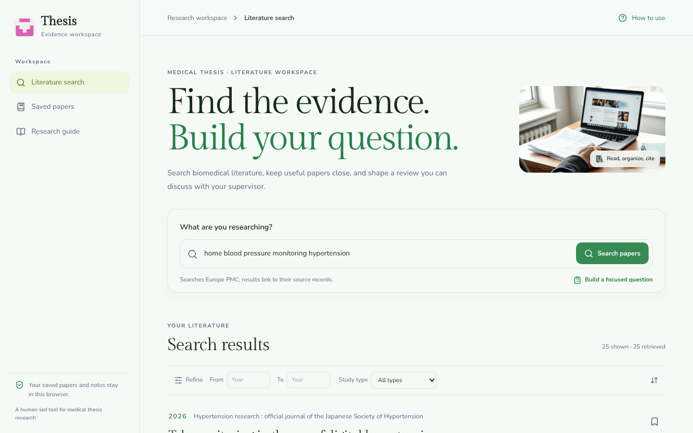

# Med Thesis Search

> Type a medical topic, get real papers back, save the good ones with your notes, and export them as a reference list for your thesis.

**Live:** https://achma-learning.github.io/searchAIOv1/
**v0:** https://searchaio-temp.chantan.one/
**v0 (backup):** https://499fa4f3748c4af2bc991c7b8770ad790tmkao04fjpq6kwqkohvhzxeesh.livepreview.chantan.one/



## What it is

A one-page research workspace for medical students writing a thesis. You search biomedical literature (via [Europe PMC](https://europepmc.org/)), filter by year and study type, read abstracts, keep a shortlist with your own notes, and download it as BibTeX or CSV. There's also a short built-in guide for turning a vague topic into a focused PICO question.

The unusual part: **no account, no server, no database.** Your saved papers and notes stay in your browser's local storage. That keeps it private and free to host, but it also means clearing your browser data wipes your list. Export your list regularly.

It was built with the [Chantan](https://chantan.studio) AI site builder and is hosted as a static site on GitHub Pages.

## Install & run

You only need this if you want to change the code. To use the app, just open the live link above.

Requires **Node.js 22** (that's what CI uses; 20+ should work).

```bash
git clone https://github.com/achma-learning/searchAIOv1.git
cd searchAIOv1
npm install
npm run dev          # → http://localhost:5173
```

No environment variables are needed. `.env.example` lists Supabase keys, but they're template leftovers and the app doesn't read them.

To build it the same way GitHub Pages does:

```bash
PAGES_BASE=/searchAIOv1/ npx vite build --config vite.config.pages.ts
npx vite preview --config vite.config.pages.ts   # → http://localhost:4173/searchAIOv1/
```

Deploying is automatic: every push to `main` runs `.github/workflows/deploy-pages.yml` and updates the live site.

## Usage

1. Open the [live site](https://achma-learning.github.io/searchAIOv1/).
2. Type a question in plain words, e.g. `home blood pressure monitoring hypertension`, and press **Search papers**. You get the top 25 matches from Europe PMC.
3. Narrow it with **From / To year** or **Study type** (Review, Clinical trial, Randomized trial). The filters only narrow those 25 results; they don't run a new search.
4. Click a paper to read its abstract, **Copy citation**, and write a private note.
5. Hit the bookmark icon to save it. Open **Saved papers** in the sidebar and export with **BibTeX** (for Zotero/Mendeley/LaTeX) or **CSV** (for a spreadsheet).

If you're not sure what to search for yet, start with **Research guide** in the sidebar. It walks you through PICO and has a one-click example search.

If Europe PMC is down or finds nothing, the app gives you ready-made links to run the same search on PubMed, Google Scholar, Cochrane Library and CISMeF.

## What's new

**2026-10-08**: the app now lives on GitHub Pages and redeploys on every push to `main` ([achma-learning/searchAIOv1#1](https://github.com/achma-learning/searchAIOv1/pull/1)).

## Why I built this

Finding papers for a medical thesis usually means juggling PubMed tabs, a notes document and a reference manager that don't talk to each other. I wanted one calm page where I can search, shortlist, jot down why a paper matters, and walk away with a reference file I can show my supervisor.

## License

[PolyForm Noncommercial 1.0.0](./LICENSE). Free to use, copy and change for learning, teaching, research and other non-commercial purposes. Schools, universities and public health organizations are explicitly covered. **Selling it or using it commercially is not allowed.** If you share a copy, include the `LICENSE` file.

## See also

- [`CONTEXT.md`](./CONTEXT.md): the project explained for AI assistants (file map, gotchas, how the Chantan sync works).
